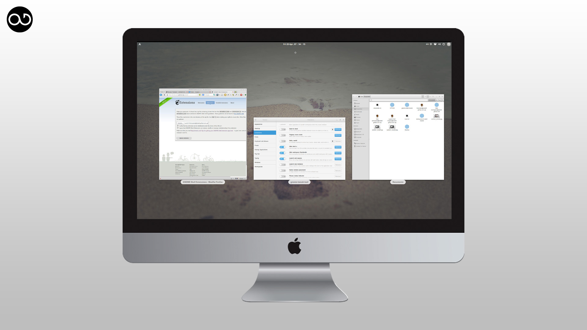
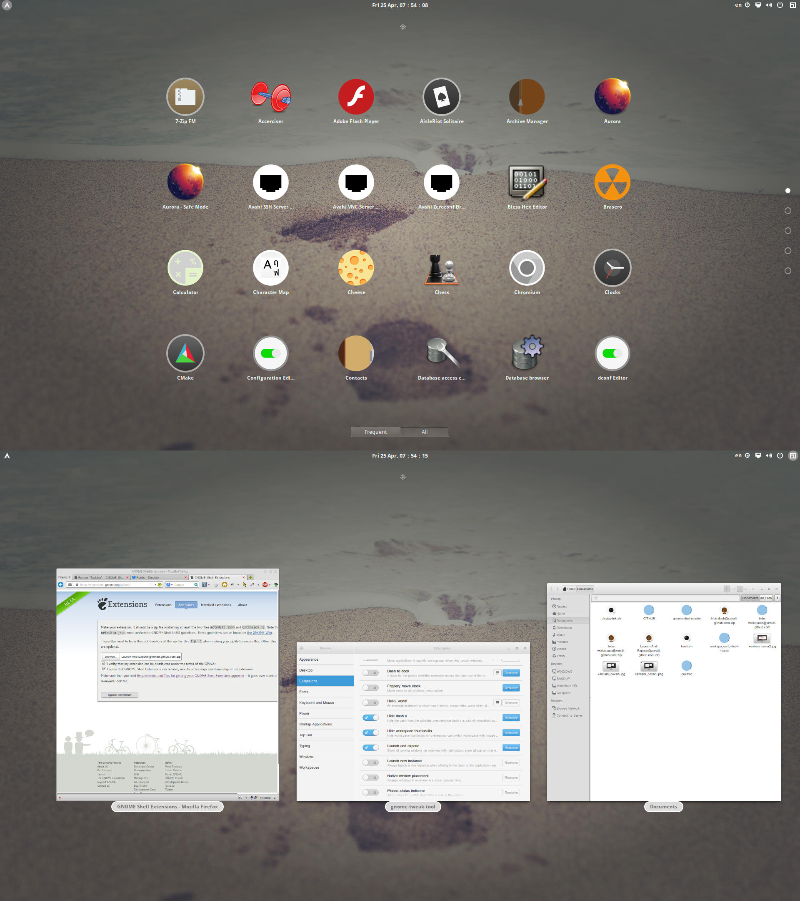

Project Minimalism Gnome Shell
==============================

Minimalism Gnome Shell  Extension &amp; More    
Gnome Shell extension for Make gnome shell to minimalism style    

-----------------

This repository is Stable release

**Hide Dash X**

----------------------    

Hide WorkSpace Thumbnails

----------------------                            
Launch And Expose

----------------------    